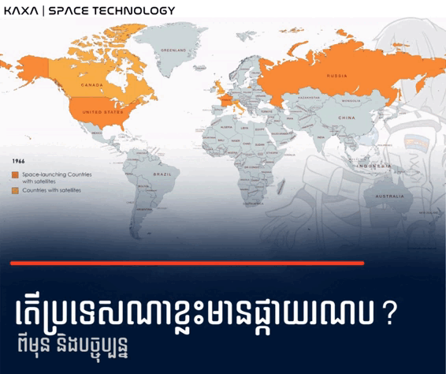

# ផ្កាយរណប | Satellite 

Category: | KAXA --> Space Technology

## សេចក្តីផ្តើម
កម្រងអត្ថបទណែនាំអំពីបច្ចេកវិទ្យាផ្កាយរណបជាភាសាខ្មែរ។

មាតិកា
1. តើផ្កាយរណបជាអ្វី?
2. តើប្រទេសណាមានផ្កាយរណប? ពីមុន និងបច្ចុប្បន្ន
3. ប្រភេទគន្លងនៃផ្កាយរណប
4. មុខងារនៃផ្កាយរណប
5. ប្រភទផ្កាយរណបតាមទំហំនិងម៉ាស់
6. គ្រឿងបង្គុំសំខាន់ៗនៃផ្កាយរណប

## 1. តើផ្កាយរណបជាអ្វី?
ផ្កាយរណប គឺជាវត្ថុមួយដែលគោចរជុំវិញវត្ថុធំជាងខ្លួននៅក្នុងលំហអវកាស ដែលអាចជាផ្កាយរណបធម្មជាតិ ឬ ផ្កាយរណបសិប្បនិម្មិត។ 

ព្រះច័ន្ទវិលជុំវិញផែនដី គឺជាឧទាហរណ៍នៃផ្កាយរណបធម្មជាតិ ចំណែកផ្កាយរណប GPS វិលជុំវិញផែនដី គឺជាឧទាហរណ៍នៃផ្កាយរណបសិប្បនិម្មិត។

ផ្កាយរណបដែលបានបាញ់បង្ហោះទៅអវកាសដំបូងគេគឺ Sputnik នៅឆ្នាំ ១៩៥៧។

គិតត្រឹមខែឧសភា ឆ្នាំ 2022 មានផ្កាយរណបចំនួន 5,465 គោចរជុំវិញផែនដី ហើយ 3,433 ជារបស់សហរដ្ឋអាមេរិក។

ផ្កាយរណបមានសារៈសំខាន់សម្រាប់ជីវិតប្រចាំថ្ងៃរបស់យើង។ 

ឧទាហរណ៍ ផ្កាយរណប GPS ប្រាប់ពីទីតាំងពិតប្រាកដរបស់យើង ផ្កាយរណបអាកាសធាតុ ជួយព្យាករណ៍អាកាសធាតុ ហើយផ្កាយរណបទំនាក់ទំនងអាចបញ្ជូនសញ្ញាទូរទស្សន៍ និងការហៅទូរសព្ទជុំវិញពិភពលោកបាន។

## 2. តើប្រទេសណាមានផ្កាយរណប? ពីមុន និងបច្ចុប្បន្ន

គិតត្រឹមថ្ងៃទី 30 ខែមេសា ឆ្នាំ 2022 មានផ្កាយរណបចំនួន 5,465 គោចរជុំវិញផែនដី។

ដើម្បីទទួលបានការយល់ដឹងកាន់តែច្បាស់ UCS Satellite Database បានបង្កើតរូបភាពពីរ ដែលប្រៀបធៀបប្រទេសដែលមានផ្កាយរណបផ្ទាល់ខ្លួន រវាងឆ្នាំ 1966 និង 2020។

ពណ៌​ទឹកក្រូច​ស្រាល៖ បង្ហាញ​ប្រទេស​ដែល​មាន​ផ្កាយរណប
ពណ៌ទឹកក្រូចងងឹត៖ បង្ហាញពីប្រទេសដែលមានសមត្ថភាពបាញ់បង្ហោះយានអវកាស + មានផ្កាយរណប

ដូចដែលបានបង្ហាញក្នុងរូបភាព ប្រទេសជាច្រើនជុំវិញពិភពលោកមានផ្កាយរណបផ្ទាល់ខ្លួនរួចហើយ។

## 3. ប្រភេទគន្លងនៃផ្កាយរណប
ប្រភេទគន្លងនៃផ្កាយរណប

ក្នុងផុសនេះ យើងនឹងស្វែងយល់ពីភាពខុសគ្នារវាងគន្លងបីប្រភេទរបស់ផ្កាយរណប Low Earth Orbit (LEO), Medium Earth Orbit (MEO) និង Geostationary Orbit (GEO)។

អាស្រ័យលើគោលបំណង និងការប្រើប្រាស់របស់ផ្កាយរណប គេបង្ហោះផ្កាយរណបក្នុងគន្លងប្រភេទផ្សេងៗគ្នា ដែលអាចផ្តល់នូវគុណសម្បត្តិ និងសមត្ថភាពផ្សេងៗគ្នាផងដែរ។

| Type| LEO | MEO | GEO |
| ------------- | --- | --- | --- |
| Altitude  | 200 - 1,600  km  | 5,000 - 20,000 km | 36,000 km |
| Orbital period  | 85 - 120 mins | 3 - 7 hours | 24 hours |
| Lifespan  | 3 - 7 years | 15 years | 15+ years |
| Applications  | Telecommunications (internet) | Navigation systems (GNSS) | Earth observation (Weather prediction) |

## 4. មុខងារនៃផ្កាយរណប
កំពុងរៀបចំ

## 5. ប្រភទផ្កាយរណបតាមទំហំនិងម៉ាស់
កំពុងរៀបចំ

## 6. គ្រឿងបង្គុំសំខាន់ៗនៃផ្កាយរណប
កំពុងរៀបចំ
